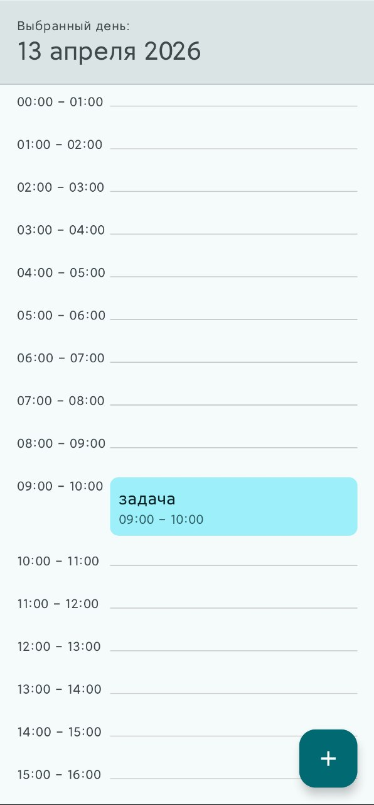
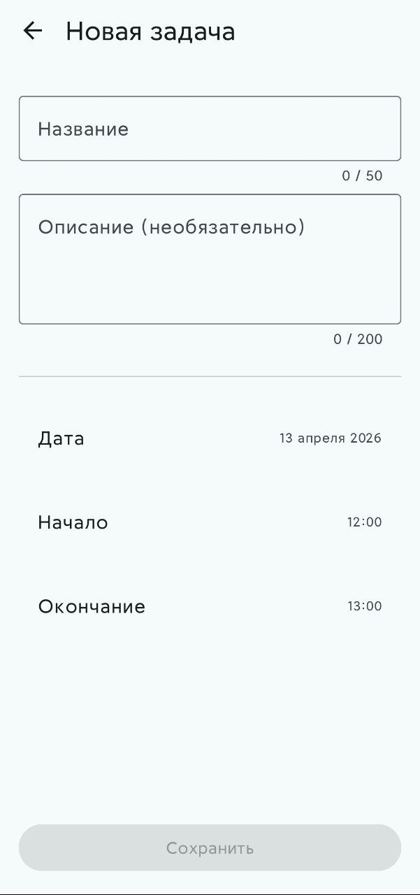
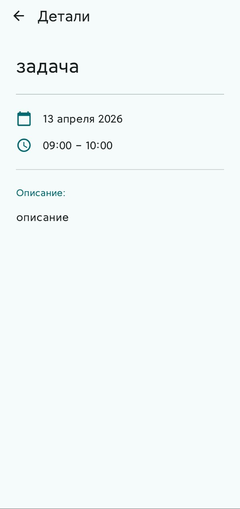

# Daily Planner

Минималистичный ежедневник с таймлайном дня и календарем

> **[Смотреть видео работы приложения](https://disk.360.yandex.ru/i/J61OhIGKlCCxPA)**

  
  &nbsp;&nbsp;
  
  &nbsp;&nbsp;
  

## 🛠 Стек технологий

- **UI:** Jetpack Compose (Material 3).
- **Архитектура:** Clean Architecture + MVI.
- **Навигация:** Type-Safe Navigation Compose (Kotlin Serialization).
- **База данных:** Room + Coroutines/Flow.
- **DI:** Dagger Hilt.
- **Анализ кода:** Detekt.
- **Тесты:** JUnit4, MockK, Turbine.

## 📦 Структура проекта

Проект разбит на модули:
- `:app` - точка сборки (Umbrella) и DI графа.
- `:core:*` - переиспользуемые компоненты (UI, утилиты).
- `:feature:planner:api` - контракты (Domain/UI модели, интерфейсы).
- `:feature:planner:impl` - имплементация фичи (Экраны, ViewModels, UseCases, Room DAO).
